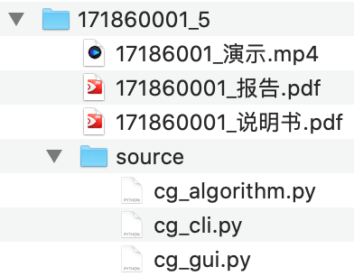

# 南京大学《计算机图形学》课程大作业

## 作业内容

本课程作业是横跨一学期的项目，要求跟随课程进度在项目中实现各种图形学算法，最终完成一个完整的图形学系统，进度自由安排，**3月31日**、**4月30日**提交**进度报告**和**已完成代码**，**5月31日**提交**系统报告**、**完整的系统**、**系统使用说明书**和**系统演示视频**。

截止时间：
> 提交日的**23:00**

提交方式：
> 稍后公布

提交内容：
> 一个`7z`压缩包

命名方式：
>“学号\_月份.7z”，例如“17186001\_3.7z”。当提交错误，或有内容更新时，加上“\_v2”、“\_v3”等后缀重新提交，例如“17186001\_3\_v2.7z”。以截止时间前最晚的提交为准

文件结构：
> ```
> 学号_月份
>   |- 学号_报告.pdf
>   |- 学号_说明书.pdf
>   |- 学号_演示.mp4
>   |- source
>   |    |- cg_alforithms.py
>   |    |- cg_cli.py
>   |    |- cg_gui.py
>   |    |- ...
>   |- ...
> ```
> 例如
>
> 

